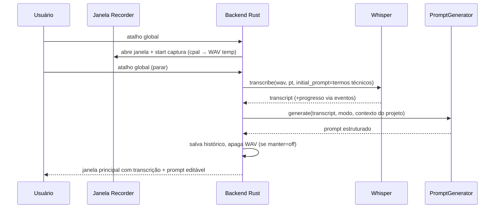

# CodeVoice — ARCHITECTURE

> Versão 0.1 · Fase 0 · 22/07/2026
> Público-alvo deste documento: modelos (Opus/Sonnet) e humanos implementando as fases do MASTER-PLAN.md. Siga as decisões aqui registradas; mudanças exigem novo ADR.

## 0. Identidade do app

- **Nome definitivo**: CodeVoice (confirmado pelo Jorge em 22/07/2026 — não é mais provisório).
- **Bundle identifier** (Tauri `tauri.conf.json` → `identifier`): `com.jorgebraga.codevoice`. Usado também para o diretório de dados (`%APPDATA%/com.jorgebraga.codevoice/`, nome de exibição livre) e para o registro do instalador Windows. Definir na Fase 1; trocar depois exige migração de dados do usuário.
- **Repositório**: GitHub, conta pessoal **Jorgebragga12** (não a conta de trabalho Inconformedia). Criar/pushar o remoto é uma ação de rede que só será executada mediante pedido explícito do Jorge.

## 1. Stack validada

| Camada             | Escolha                                   | Observação                                                     |
| ------------------ | ----------------------------------------- | -------------------------------------------------------------- |
| Shell desktop      | **Tauri 2**                               | WebView2 já presente no Win10/11; binário pequeno; Rust nativo |
| UI                 | **React 19 + TypeScript (strict) + Vite** |                                                                |
| Estilo             | **Tailwind CSS 4**                        | tema escuro único                                              |
| Estado UI          | **Zustand**                               | stores finos; sem Redux                                        |
| Nativo             | **Rust** (edition 2021+)                  | toda lógica de domínio                                         |
| Banco              | **SQLite** via `rusqlite` (bundled)       | acesso só no lado Rust — ver ADR-003                           |
| Transcrição        | **whisper.cpp** via `whisper-rs`          | ver ADR-001                                                    |
| Geração de prompt  | `claude` CLI headless + templates         | ver ADR-002                                                    |
| Áudio              | **cpal** + **hound** (WAV)                | captura 16 kHz mono PCM                                        |
| Tipos IPC          | **specta + tauri-specta**                 | commands Rust geram tipos TS automaticamente                   |
| Settings sensíveis | **keyring** (Windows Credential Manager)  | ver SECURITY-MODEL.md                                          |
| Logs               | **tauri-plugin-log** + `tracing`          | rotação, filtro de secrets                                     |

Compatibilidade Windows verificada na Fase 0: Node v24, Rust 1.97, WebView2 nativo no Win11. Nenhuma incompatibilidade conhecida na stack preferencial, com uma exceção: **faster-whisper foi rejeitado para o MVP** (exigiria embutir runtime Python — ver ADR-001).

## 2. Princípio central

**O frontend é burro.** Componentes React apenas renderizam estado e disparam commands. Toda lógica de negócio — gravação, transcrição, geração, storage, filesystem, terminal — vive em módulos Rust isolados atrás de traits. Nenhum acesso a filesystem/banco/rede a partir do TypeScript.

## 3. Camadas e módulos (Rust)

```
src-tauri/src/
├── main.rs / lib.rs        # bootstrap, registro de plugins e commands
├── commands/               # camada IPC: 1 arquivo por área; funções finas que delegam
│   ├── projects.rs
│   ├── recording.rs
│   ├── transcription.rs
│   ├── promptgen.rs
│   ├── history.rs
│   ├── settings.rs
│   └── terminal.rs
├── domain/                 # tipos de domínio puros (Project, Recording, Prompt, Mode…)
├── audio/                  # captura (cpal), escrita WAV (hound), listagem de dispositivos
├── transcription/
│   ├── mod.rs              # trait TranscriptionEngine
│   ├── whisper.rs          # impl WhisperRs
│   └── model_manager.rs    # download/verificação SHA-256 de modelos
├── promptgen/
│   ├── mod.rs              # trait PromptGenerator
│   ├── claude_cli.rs       # impl via `claude -p` (processo filho)
│   ├── templates.rs        # impl determinística (fallback offline)
│   └── modes.rs            # definição dos 10 modos e suas seções
├── projects/
│   ├── mod.rs              # CRUD + validação
│   └── scanner.rs          # importação assistida (denylist! ver SECURITY-MODEL)
├── storage/
│   ├── mod.rs              # pool de conexão, repositórios
│   └── migrations.rs       # migrations sequenciais embutidas
├── terminal/               # abrir terminal na pasta, detectar `claude`, colar sob ação
├── settings/               # tauri-plugin-store (geral) + keyring (sensível)
└── security/               # validação de paths, filtro de secrets p/ logs
```

Contratos-chave (assinaturas norteadoras; ajustar detalhes na implementação):

```rust
pub trait TranscriptionEngine: Send + Sync {
    fn transcribe(&self, audio: &Path, opts: TranscribeOptions,
                  progress: ProgressSink) -> Result<Transcript, TranscribeError>;
    fn is_ready(&self) -> EngineStatus; // ModelMissing | Downloading | Ready
}

pub trait PromptGenerator: Send + Sync {
    fn generate(&self, input: GenerationInput) -> Result<GeneratedPrompt, GenError>;
    // GenerationInput = { transcript, mode, project_context, refine_action: Option<RefineAction> }
    // RefineAction = Shorten | Expand | MoreTechnical | SplitIntoSteps | Regenerate
}
```

## 4. Frontend (React)

```
src/
├── app/                # App, roteamento simples (poucas telas), error boundary global
├── windows/
│   ├── main/           # telas: Home (fluxo principal), Projects, History, Settings
│   └── recorder/       # janela compacta de gravação
├── components/         # UI reutilizável, sem lógica de domínio
├── stores/             # Zustand: recordingStore, projectStore, promptStore, settingsStore
├── ipc/                # bindings gerados pelo tauri-specta (não editar à mão)
└── lib/                # helpers puros (formatação, datas)
```

Regras: nenhum arquivo > ~300 linhas; componentes sem `invoke` direto (sempre via `ipc/`); estado derivado de eventos Tauri (`recording:started`, `transcription:progress`, etc.).

## 5. Fluxo do caminho feliz (sequência)



## 6. Plugins Tauri 2 utilizados

`global-shortcut`, `tray-icon` (nativo do Tauri), `autostart`, `clipboard-manager`, `single-instance`, `store`, `log`, `opener` (abrir pastas), `shell` restrito (apenas para spawn do terminal e do `claude` — escopo mínimo no capabilities). `updater` fica preparado mas desativado no MVP.

Capabilities (Tauri 2 ACL): conceder a cada janela apenas o necessário; a janela recorder não tem acesso a shell/fs.

## 7. Decisões de arquitetura (ADRs)

### ADR-001 — Transcrição: whisper-rs (whisper.cpp), não faster-whisper

**Contexto**: faster-whisper é Python (CTranslate2); embutir Python + deps no instalador Windows custa ~1 GB e um sidecar frágil. whisper.cpp tem binding Rust maduro (`whisper-rs`), roda in-process, CPU por padrão com aceleração opcional (Vulkan/CUDA via features).
**Decisão**: `whisper-rs` in-process, atrás do trait `TranscriptionEngine`. Modelo padrão **large-v3-turbo** (bom PT-BR, rápido); alternativas `medium`/`small` selecionáveis. Modelos baixados on-demand (não embutidos no instalador), com verificação SHA-256.
**Consequência**: benchmark na Fase 5 na máquina do usuário passa a servir para **validar** desempenho (e decidir se vale oferecer `medium`/`small` para hardware fraco), não para escolher o modelo — `large-v3-turbo` já é definitivo. Se a qualidade/velocidade em PT decepcionar, trocar a impl sem tocar no resto do app.
**Status**: **confirmada pelo Jorge em 22/07/2026** (`large-v3-turbo` travado como padrão).

### ADR-002 — Geração de prompts: `claude` CLI headless + templates fallback

**Contexto**: ações como "deixar mais técnico" e "detalhar" exigem um LLM; templates puros não reescrevem texto. O usuário já tem Claude Code instalado e assinatura ativa.
**Decisão**: provedor primário `ClaudeCliGenerator` — spawn de `claude -p "<meta-prompt>" --output-format json` com o texto passado via **stdin** (nunca interpolado em linha de comando), timeout e sem acesso a ferramentas (`--tool none`/allowedTools vazio — validar flag exata na Fase 6). Fallback `TemplateGenerator` determinístico quando o CLI está ausente/falha/offline: monta as seções do modo a partir da transcrição limpa, sem reescrita.
**Consequência**: interface `PromptGenerator` permite adicionar outro provedor no futuro sem tocar no resto do app — inclusive um `OpenAiGenerator` (ChatGPT via API), avaliado e adiado deliberadamente (ver ADR-002b). O modo "Transcrição limpa" nunca usa LLM.
**Status**: **confirmada pelo Jorge em 22/07/2026.**

### ADR-002b — OpenAI/ChatGPT como provedor: opção B plugável, fora do MVP

**Contexto**: o Jorge perguntou se a geração poderia usar ChatGPT em vez de (ou além de) `claude` CLI.
**Decisão**: não incluir no MVP por padrão. Motivos: (1) exigiria chave de API da OpenAI gerenciada via `keyring` já na Fase 6, em vez da Fase 10 como planejado para outros segredos; (2) custo por token, enquanto `claude` CLI usa a assinatura já paga do Jorge sem custo marginal; (3) nenhum ganho de qualidade claro para justificar adiantar essa complexidade. A trait `PromptGenerator` já suporta a extensão sem refatoração: adicionar `OpenAiGenerator` no futuro (ou já na Fase 6, se o Jorge pedir) é só mais uma implementação do trait + um seletor de provedor em Settings.
**Status**: aceita — revisitável a qualquer momento; basta o Jorge confirmar que quer isso já na Fase 6.

### ADR-003 — SQLite só no lado Rust (rusqlite, não tauri-plugin-sql)

**Contexto**: `tauri-plugin-sql` expõe SQL ao frontend, quebrando a separação de camadas e complicando validação.
**Decisão**: `rusqlite` (feature `bundled`) com repositórios em `storage/` e migrations próprias sequenciais embutidas (ver DATABASE-SCHEMA.md). WAL mode. FTS5 para busca do histórico.
**Status**: aceita.

### ADR-004 — Tipos IPC gerados (tauri-specta)

Commands anotados geram bindings TS; elimina drift de tipos entre Rust e TS. **Status**: aceita.

### ADR-005 — "Colar no terminal" via clipboard + ação do usuário

**Contexto**: injetar keystrokes em outra janela é frágil e perigoso.
**Decisão**: MVP copia para clipboard e abre o terminal na pasta; o "colar" é o usuário pressionando `Ctrl+V` (opcionalmente o app envia o paste **apenas** quando o usuário clica no botão "Colar no terminal", nunca automaticamente). Integração programática profunda (ex.: `claude -p` direto, MCP) fica preparada pela interface `ClaudeCodeIntegration` mas fora do MVP.
**Status**: aceita.

## 8. Tratamento de erros e logs

- Erros Rust: `thiserror` por módulo (a partir da Fase 2, quando os primeiros commands com `Result` existirem), convertidos em um tipo `AppError { code, message_pt, detail }` serializável na borda IPC. Frontend mostra `message_pt` e oferece ação (repetir, abrir configurações…).
- Logs: `tauri-plugin-log` (facade `log`, não `tracing` — decisão da Fase 1: o plugin já opera sobre `log::Record` por padrão, sem precisar da feature `tracing`; revisitar apenas se surgir necessidade real de spans estruturados) → stdout em dev + arquivo com rotação em `%APPDATA%/com.jorgebraga.codevoice/logs/`. **Todo log passa pelo formatter customizado que aplica `security::log_filter::redact()`** (ver SECURITY-MODEL.md §4), implementado e testado na Fase 1. Nível configurável; padrão `info`.
- Error boundary React global (implementado na Fase 1, `src/app/ErrorBoundary.tsx`) + handler de panics Rust que loga e mostra diálogo (panic hook fica para quando houver diálogo de erro nativo, Fase 10).

## 9. O que NÃO fazer (anti-requisitos para os implementadores)

- Não colocar lógica de domínio em componentes React ou stores.
- Não acessar fs/banco/rede pelo TypeScript.
- Não interpolar texto do usuário em linha de comando (stdin/arquivo sempre).
- Não criar arquivos gigantes (>~300 linhas TS, >~400 linhas Rust — dividir).
- Não adicionar dependência sem justificar no relatório da fase.
- Não implementar transcrição por API nem integração profunda com Claude Code no MVP — apenas manter os traits prontos.
